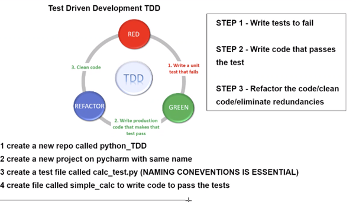

# Test Driven Development (TDD)

## Summary

This is the first practice case of test driven development in python. Unit test for a simple calculator will be written and calculator class will be coded to pass the unit tests that involve addition, subtraction, division and multiplication. Let's dive into coding.


- Step one is to create a repository along with a new project on pycharm.
- We now create a file called calc_test.py.
- We will use `unittest` and `pytest`.
- installing `unittest` by typing the command `pip install unittest2`.
- installing `pytest` by typing the command `pip install pytest`.
- Unit tests were contained in file known as calc_test.py and the code to be tested was kept in simple_calc.py.

- The approach that will be taken can be seen in the image below.



## calc_test.py (unit tests)
- `pytest`, `unitest` and `simple_calc.py` are imported at the top of the page.
- test class created that contained all unit tests.


```python
import unittest
import pytest
from simple_calc import SimpleCalc

class Calctest(unittest.TestCase):
    calc = SimpleCalc()
    
    def test_add(self):
        self.assertEqual(self.calc.add(3,2), 5)

    def test_subtract(self):
        self.assertEqual(self.calc.subtract(3,2), 1)

    def test_multiply(self):
        self.assertEqual(self.calc.multiply(2, 2), 4) # 2 * 2 = 4

    def test_divide(self):
        self.assertEqual(self.calc.divide(6, 3), 2)  # 6 / 3 = 2
```


## Simple_calc.py (Code to be tested)

- SimpleCalc class created and function written to pass the test

```python
class SimpleCalc:

    def add(self, num1, num2):
        return num1 + num2      # if outcome is 5 then the condition is true and the test would pass.

    def subtract(self, num1, num2):
        return num1 - num2     # testing 2 values as boolean

    def multiply(self, num1, num2):
        return num1 * num2

    def divide(self, num1, num2):
        return num1 / num2
```


